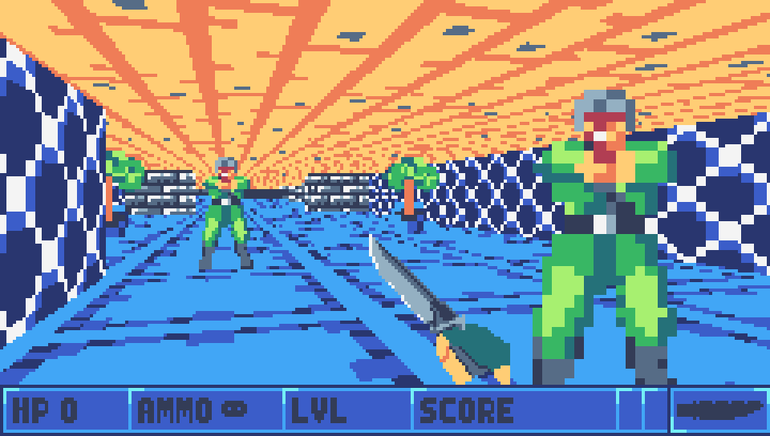
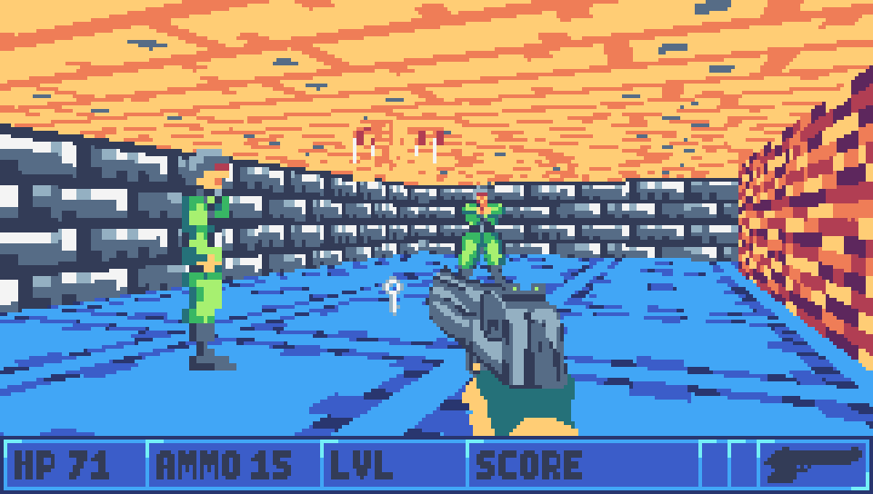
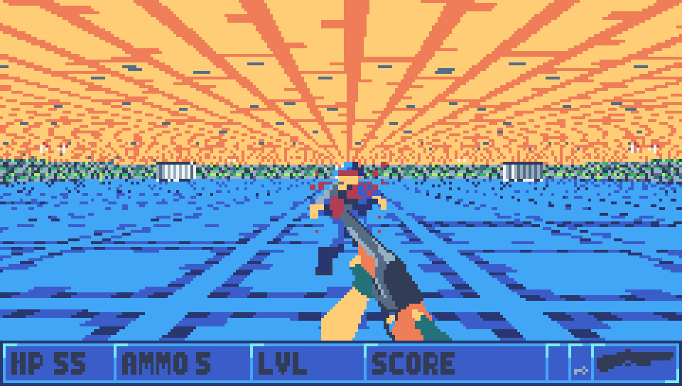
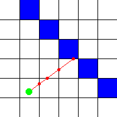
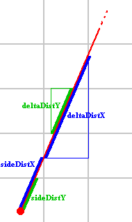
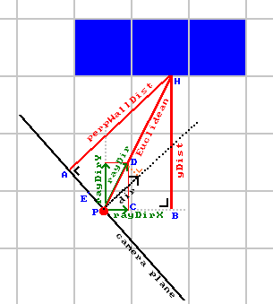
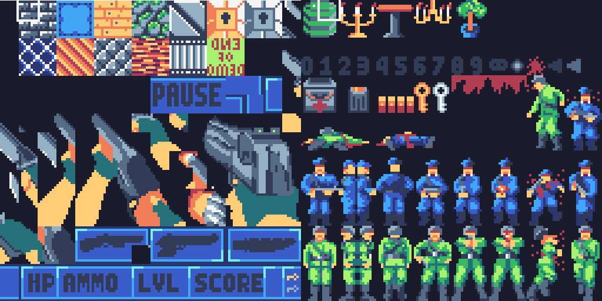
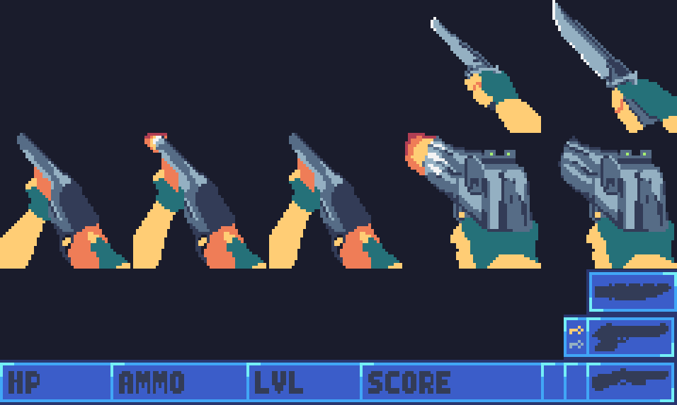
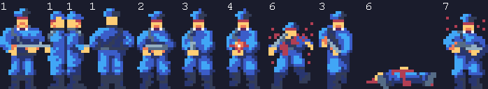

# Wolf-80

A 3D first-person shooter game on the TIC-80 virtual console, inspired by Wolfenstein3D.

Playable online [here](https://tic80.com/play?cart=2333)

#### Features
- 3D raycast graphics
- 3 weapon types
- 2 enemy types
- Item pickups

#### Planned Features
- Multiple levels
- Music & SFX

#### Screenshots

#### Repository Structure

Source code for renderer: [raycast.lua](raycast.lua)

Source code for game: [wolf-80.lua](wolf-80.lua)

Cartridge for game: [wolf-80.tic](wolf-80.tic)

## How to make your own 3D FPS game from scratch
Wolfenstein3D-style videogames with raycast graphics have been left behind in the 90s, however, they can still provide a fun gaming experience, albeit at the cost of the last 30 years of improvements in graphics technology. Back then, the absence of OpenGL or DirectX meant that rendering engines had to be hand-crafted, and instead of simply passing an array of triangles which are then rendered on screen by means of magic and proprietary NVIDIA drivers, the color of every pixel had to be manually calculated and displayed. While writing a custom 3D engine is just about the worst idea for anyone but the biggest videogame studios due to the sheer amount of optimization and features which would be sacrificed, there is still massive educational value in understanding the mathematics involved in creating a raycast renderer.

In order to achieve maximal immersion, I recommend writing the program for a fantasy console, such as the [TIC-80](https://tic80.com) or [PICO-8](https://www.lexaloffle.com/pico-8.php), wherein a 3D graphics API is not provided, and there is good justification for writing one from scratch. In this article, I will discuss the principles behind raycast rendering, as well as the other aspects of a Wolfenstein3D-inspired game, and some of the issues involved with creating such a game on the TIC-80.

### Raycast Graphics Basics
Virtually all modern graphics engines operate the same way: an input of triangles is taken, each triangle is projected onto the screen through a series of matrix multiplications, and then the closest triangles are displayed on screen. A simple implementation of these graphics can be found [here](https://github.com/wojciech-graj/TermGL), however, this project will be avoiding this rendering method, and instead opt for raycasting due to its relative computational simplicity. I highly recommend [this](https://lodev.org/cgtutor/raycasting.html) very interesting and complete article which gives an in-depth explanation of all of the raycasting mathematics. I will only cover the general principles involved in raycasting as to not simply create an inferior/duplicate version of that article.

Raycasting operates on the idea of sending out a horizontal ray from the camera for every vertical line on the screen, and drawing the first wall which it encounters. However, in order to obtain acceptable performance, a few restrictions must be imposed:
- The level is flat: The player is always at the same height, the floors and ceiling have a constant height, and walls can have fractional heights but cannot be taller than the ceiling
- All walls are on a grid: each square on the grid can either be a wall or not
- Walls are all opaque
- The camera is always horizontal and cannot be tilted up or down, but can rotate to the left or right
- All things (i.e. enemies, items, etc.) are drawn as 2D images

The utility of these restrictions can be explained as follows. The level must be flat because the rays which are sent out are horizontal, and checking which level of wall it encounters first would be difficult due to perspective. Additionally, we couldn't stop searching for intersections after hitting a wall, as there could be others above/below it. The walls must be opaque for the same reason, as transparencies would require additional searching for walls behind the transparency. Differences in perspective caused by tilting the camera up or down can be avoided by keeping the camera perfectly horizontal, which also allows for a very simple subroutine for rendering the floor and ceiling. And by drawing things as 2D images, projection of their 3D models can be avoided.

### Rendering Walls

When a ray is sent out, every possible intersection with the edges of map cells must be found, in order from closest to farthest. This is shown in the below diagram ([source](https://lodev.org/cgtutor/images/raycasthit.gif)).

To achieve this, after every intersection, one can find the distance which will have to be traveled along the ray in order to hit the next X or Y wall face. Depending on which distance is smaller, the intersection with that grid cell will be checked, then the process will repeat until an intersection is found. This is shown in the below image ([source](https://lodev.org/cgtutor/images/raycastdelta.gif)).

After finding an intersection, one can find the perpendicular distance to the wall, and then draw the wall, which will have a height inversely proportional to the perpendicular wall distance, and will be vertically centered at the middle of the screen. It is important to avoid simply taking the Euclidean distance, as this leads to a fish-eye lens effect and can make some players sea-sick. The diagram below shows the perpendicular wall distance which is used instead when calculating the wall's height ([source](https://lodev.org/cgtutor/images/raycastperpwalldist.gif)).

In order to find which part of the wall's texture must be drawn for each pixel, it is known that the x-position along the texture will remain the same, while the y-position will have to cycle through the entire picture. A simple linear interpolation can be performed by calculating how far one has to move along the texture's y-axis for each pixel on screen, adding said value for each pixel which is drawn, and finding the texture's color in that spot.

Following these steps, vertical wall slices can be drawn for each vertical line of pixels, however, a blank area is left above and below them. Using this area is discussed in the next section.

### Rendering Floors and Ceilings

While floors and ceilings are disabled by default in Wolf-80, this is simply because they fill all empty spaces on the screen, meaning that all pixels have to be drawn, thereby vastly reducing the framerate. Nonetheless, drawing them can really improve the game's visuals, as they create the sense of actually being in a room, as opposed to a void with walls scattered around it. Drawing floors and ceilings is covered in the second part of [Lodev's tutorial](https://lodev.org/cgtutor/raycasting2.html), but once again, I'll cover the basic principles.

Unlike walls, floors and ceilings can most optimally be drawn as horizontal scanlines. This is because, by avoiding the fisheye effect when rendering walls, all points which are equidistant to the camera plane will be shown at the same height on-screen. When rendering floors and ceilings, this means that every point in a horizontal scanline can be treated as if it has the same perspective relative to the camera, and as such, can be projected in the same way as all other points on said scanline. Knowing that the viewing ray which reaches a ceiling must go through some screen pixel and the camera's origin, one can construct a line and find the distance along it at which the floor or ceiling will be encountered. Using this distance, we can find which pixel of the floor or ceiling texture to draw.

Floors and ceiling are always drawn at the very end of the rendering process, as to fill in all blank spaces left by other level elements.

### Rendering Things

Now that walls and floors are being rendered, things are the next step. You guessed it, part 3 of [Lodev's tutorial](https://lodev.org/cgtutor/raycasting3.html) covers the mathematics behind this topic.

Rendering things isn't much different from walls, however, there are a few important tricks. First of all, in order to not waste precious memory bandwidth, it is paramount to only draw each pixel once. This means that things will have to be drawn in order from the closest to the farthest away, since closer ones could possibly occlude ones behind them.

For each vertical scanline, the euclidean distance to the wall is found, as detailed previously, however, instead of immediately drawing the wall, we first iterate over a sorted list of things until the distance to one of them exceeds the distance to the wall. For each of these things, one then checks if it should be rendered in this vertical slice, and if so, it can be drawn in a similar way to how walls were rendered.

Given that levels can include tens or even hundreds of things, performance becomes a serious consideration. In order to decrease the number of things which must be checked for each vertical scanline, the sorted list can consist only of those which are in front of the camera plane, on average halving the amount which must be checked. For further optimization, one could also check whether or not the thing would be in the camera's field of view, but this is more computationally involved and might only benefit larger scenes.

### Rendering Variable-Height Walls

A feature that the original Wolfenstein3D did not have is support for variable-height walls. In Wolf-80, walls do not have to span the whole distance from the floor to the ceiling, but can instead have a fractional height. This requires a slight modification to the wall rendering code.

Now, instead of stopping the raycasting procedure upon hitting a wall, stopping will only occur once a full-height wall is hit. Walls that lie beyond variable-height walls will be rendered upwards from the top of the variable-height wall, and if a wall has less than half-height, a raised floor will have to be drawn to cover the top of the wall.

In order to encode these variable-height walls in level data, each map cell will have to be split into holding both height and texture data. In Wolf-80, 4 of the 8 bits provided per cell are used to store the texture, while the other 4 define its height.

### Texutre management and Heads-Up Display

Fantasy consoles purposefully impose restrictions to remain somewhat faithful to older technology, but also as a challenge to developers. One of the most difficult tasks was to fit all of the game's textures into 512 8x8 pixel slots provided by the TIC-80.

As can be seen in the above image of the game's textures, re-using components is key. For instance, the heads-up display is built out of modular components and its textures only occupy a fraction of the on-screen space reserved for the HUD, and only parts of weapons are switched out for the shooting animation, with the rest remaining constant and not requiring additional textures. These components can be assembled to form a coherent model on the level editor, and simply displayed using the TIC-80's 2D map drawing capabilities.

### Weapons

The way in which weapons work in Wolf-80 is heavily based on the weapon mechanics in Doom. The player is provided with three weapons, a knife, pistol, and shotgun. To provide some uniqueness to each gun, they all have different values for damage, random spread, reload times, and range. Additionally, the shotgun fires a total of seven bullets, each of which has its collision checked separately.

When it comes to collision checking, Wolf-80 employs circular hitboxes, allowing for simple collision checking of a bullet's ray with enemies, by finding the shortest (perpendicular) distance from each entity's centre to the ray, and verifying if said distance is shorter than the hitbox's radius. Additionally, the algorithm which was used to find wall-ray intersections can be re-used to check if a bullet would be stopped by a wall before hitting an enemy.

Hitmarkers are also used in the game to provide the player with a visual indication of where their bullet hit, providing visual feedback and allowing for their aim to be adjusted.

### Enemy AI

Wolf-80 currently only has quite rudimentary enemy AI, yet it is sufficient to provide a fun gaming experience. An enemy can be in one of 7 states:

1: neutral, 2: raise, 3: ready, 4: shoot, 5: reload, 6: die, 7: hurt

The enemy will always start in the netural state and will simply stand still until the player enters its field of view. In the neutral state, enemies also check if the player is within one map unit of them, as to prevent the player from being able to sneak up to them. Upon either detecting the player or being damaged, they will enter their raise state, in which a weapon raising animation plays. Then, the enemy cycles through the ready, shoot, and reload states while the player is visible and in range, elsewise they will walk towards the player. Upon having their health reduced to zero, the die state is enabled, in which the death animation is played before leaving a corpse on the ground. There is also a hurt state which has a chance of being triggered whenever the enemy is hit, and will briefly stun them and prevent them from shooting.

### Conclusion

While there are still some features that I would like to add to Wolf-80, all of the basic FPS-game mechanics are present and have been explained in this article.

Creating a 3D engine on a system with such massive constraints was certainly not easy, but it was a very fun and educational experience which I can certainly recommend to anyone interested in computer graphics and maths.
